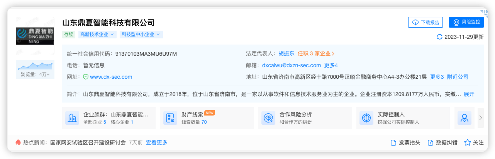

# 山东鼎夏智能科技有限公司

## 第一点 重保项目 5-7个月不结

以下为某讨债群爆出的聊天记录

案例一：

案例二：

案例三：

以前可怜农民工讨薪无门 没想到群内兄弟亦是他

😌 我也曾经以为我从事的是保护国家网络安全的一名白帽子 没想到 竟是如此这般 连最基本的薪酬都不能保障和境外人员无异

如此这般 等 等 等

## 第二点 护网进场强行降价 

进场前2000价格 合同白纸黑字 到达现场后 直接给出价格1000块 不接受就滚回家种田 专坑大学生，全程口头，不留聊天记录，录音后面找个合适的方式放出

## 第三点 圈人合同 主打释放

## 第四点 70%以下绩效没钱 主打情怀护网

